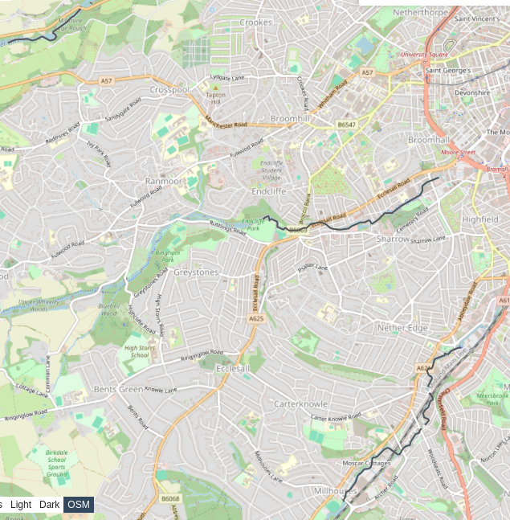

# River walks

River walks!

View geojson on a map on <https://geojson.io/#data=data:text/x-url,https%3A%2F%2Fraw.githubusercontent.com%2Falifeee%2Friver-walks%2Frefs%2Fheads%2Fmain%2Fall-river-walks.geojson>



How to get data, from [weeknote 2024/29](https://weeknotes.alifeee.co.uk/2024-29/).

```text
Here is the River Sheaf on Open Street Map (OSM)

<https://www.openstreetmap.org/relation/11890887>

It is made up of a series of "ways", which are lines with coordinates, added by normal people.

I used Overpass Turbo (<https://overpass-turbo.eu/s/1OyD>) to export a [`geoJSON`](https://geojson.org/) file for the River Sheaf (i.e., with `relation(11890887); out geom;`)

to crop:

sudo apt install gdal-bin
ogr2ogr -clipsrc -1.47927 53.34511 -1.49590 53.35812 export2.geojson export.geojson
```

## combine geojson

```bash
endfile="all-river-walks.geojson"
while read file; do
  cat "${file}";
done <<< $(find geojson -type f | sort -n) | jq -c --slurp '{
    "type": "FeatureCollection",
    "name": "combined",
    "features": ([.[] | .features[0]])
}' > "${endfile}"
```
